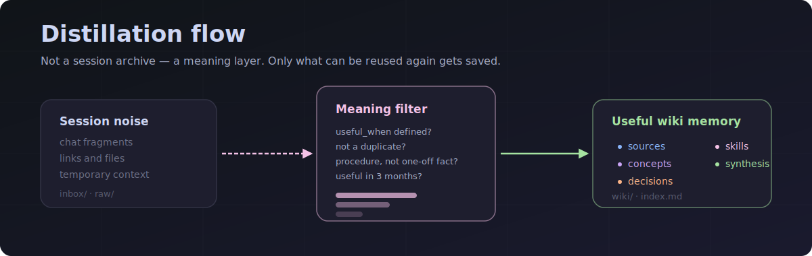
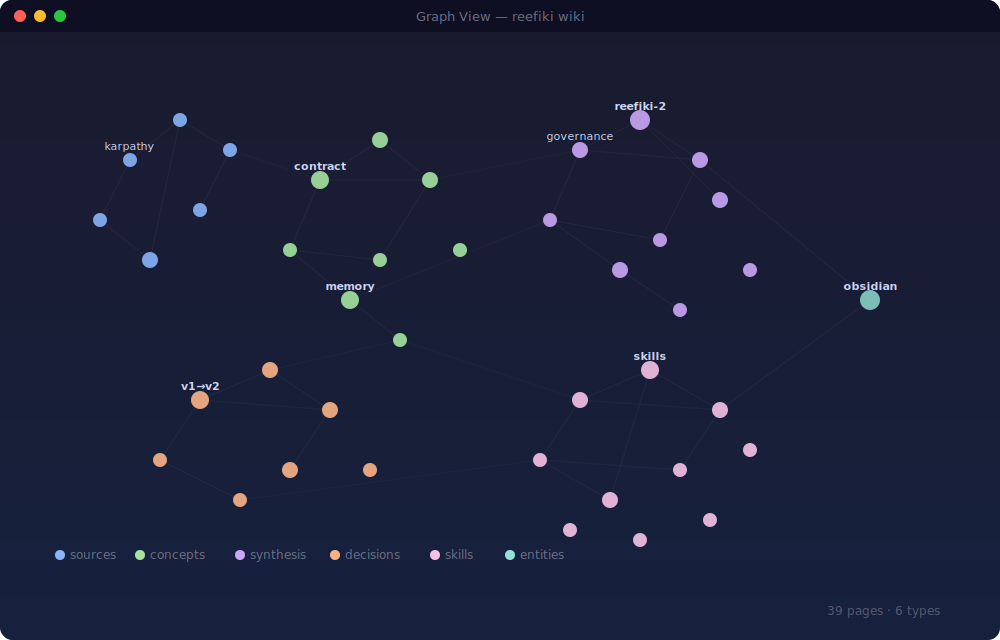
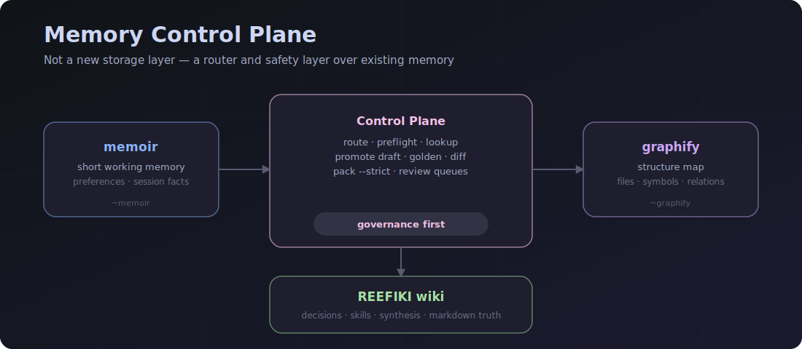
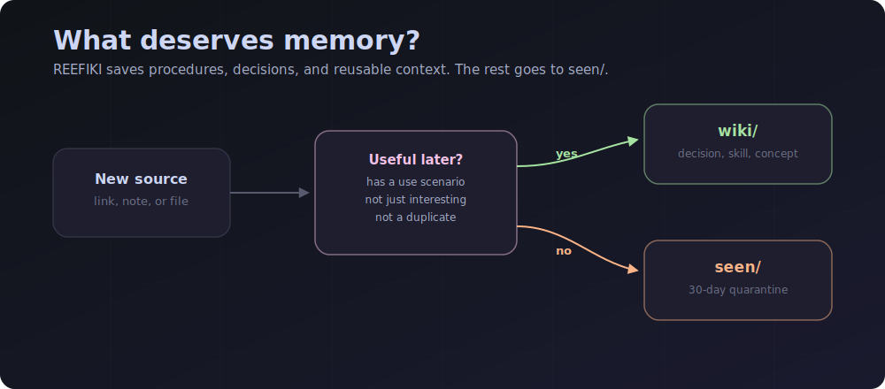
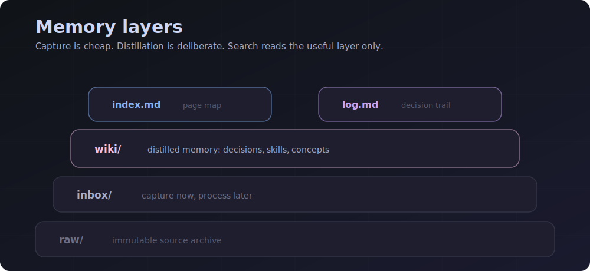

# REEFIKI 2.0



A multi-project LLM wiki and memory control plane: a personal knowledge base maintained by an AI agent.
**Agent-agnostic:** works with Claude Code, Codex, Cursor, Windsurf/Cascade, and other agents through one shared `AGENTS.md`.

REEFIKI does not store every session transcript. It stores decisions, reusable skills, synthesis notes, and sources that are useful in future work.

REEFIKI 2.0 adds a governance layer over three memory circuits: `memoir` for short working memory, REEFIKI wiki for durable knowledge, and `graphify` for codebase structure. It is not another storage layer; it routes, checks, and packages the memory you already use.

Languages: [Русский](README.md) · [中文](README.zh-CN.md)

---

## How It Works




The agent does not need to wait for slash commands. It can propose saving a decision, a reusable procedure, or a session synthesis when the moment appears.

---

## REEFIKI 2.0 — Memory Control Plane



REEFIKI 2.0 connects three memory layers without merging them into one database:

| Layer | Role | Use it for |
|---|---|---|
| `memoir` | short working memory | preferences, small rules, session facts |
| `REEFIKI wiki` | durable markdown truth | decisions, skills, procedures, synthesis |
| `graphify` | project structure map | files, symbols, relations, code navigation |

The control plane provides:

- `memory route` — decides where a new fact belongs;
- `memory preflight` — checks project/private/public boundaries before reading providers;
- `memory lookup` — retrieves context from available layers;
- `memory promote --write-draft` — creates a review draft instead of auto-writing durable pages;
- `memory golden` — checks lookup/promote quality against stable cases;
- `memory diff` — shows durable wiki changes;
- `memory pack --strict` — builds a handoff pack and fails when safety or quality gates fail.

For the user, this means: in a new thread, writing “continue REEFIKI 2” should be enough. The agent must run the context pack and golden checks itself.

---

## Philosophy



REEFIKI is not a warehouse for every agent answer. It is a memory filter: only knowledge that can be reused should become a wiki page.

| Layer | What it stores |
|---|---|
| `sources` | where an idea came from |
| `concepts` | reusable understanding |
| `decisions` | an accepted decision |
| `skills` | a reproducible procedure |
| `synthesis` | session findings |



---

## Current Capabilities

- Connects any code project through a `_wiki` junction/symlink.
- Keeps knowledge separated by project under `projects/<name>/`.
- Supports `/save`, `/process`, `/query`, `/harvest`, `/status`, `/lint`, `/reindex`, `/resolve`, and `/help`.
- Provides REEFIKI 2.0 memory commands: `status`, `preflight`, `route`, `lookup`, `promote`, `golden`, `diff`, and `pack --strict`.
- On REEFIKI 2 work, the agent should run `memory pack --strict` and `memory golden` automatically.
- Validates wiki pages: required fields, `useful_when`, `sources`, `use_count`, `last_used`, index sections, and deprecated `importance`.
- Supports page types: `sources`, `entities`, `concepts`, `synthesis`, `decisions`, and `skills`.
- Publishes a safe public snapshot without personal wiki projects.

---

## Option A — Connect an Existing Project

If you already have a code project (`H:\Projects\MyApp`) and want a wiki for it:

**1.** Open the `REEFIKI/` folder in your IDE.

**2.** Tell the agent:

```text
Connect H:\Projects\MyApp to the wiki
```

**The agent will:**

- create `REEFIKI/projects/myapp/` if needed;
- create `MyApp\_wiki` → `REEFIKI\projects\myapp`;
- add a `.reefiki` marker to the code project;
- update the code project's `AGENTS.md` with REEFIKI rules.

**3.** Open `MyApp/` as your main project and work normally.

| Tell the agent | What gets saved |
|---|---|
| "remember this" | `wiki/decisions/` or `concepts/` |
| "save this as a skill" | `wiki/skills/` |
| "capture the session findings" | `wiki/synthesis/` |
| "save this link" | `inbox/` (processed later) |
| "what did we decide about sync?" | answer from wiki only |

---

## Option B — Start From Scratch

**1.** Open `REEFIKI/` in your IDE.

**2.** Say:

```text
create a new project <name> about <topic>
```

**3.** The agent runs `/new`, copies `projects/_template/`, fills `_domain.md`, and prepares the structure.

**4.** Open `projects/<name>/` and start working.

---

## Main Commands

| Goal | Command | Natural language |
|---|---|---|
| Save a URL/file for later | `/save` | "put this in the inbox" |
| Process accumulated items | `/process` | "process the inbox" |
| Ask the wiki | `/query` | "what did we decide about X?" |
| Capture findings | `/harvest` | "remember the session findings" |
| Show project state | `/status` | "what is in the inbox?" |
| Check wiki health | `/lint` | "check the wiki" |
| Rebuild index | `/reindex` | "rebuild the index" |
| Connect a code project | `/connect` | "connect this project to the wiki" |
| Sync the template | `/sync-template` | "update projects from the template" |

Full command reference: [`COMMANDS.md`](COMMANDS.md).

Notable project changes: [`CHANGELOG.md`](CHANGELOG.md).

---

## Integrity Check

Before commit or push, run:

```powershell
python scripts/validate_frontmatter.py (rg --files projects | ? { $_ -match '[/\\]wiki[/\\].+\.md$' })
```

The validator checks:

- required wiki page fields;
- `sources` for `source` and `synthesis`;
- `verified` only for `skill`;
- no deprecated `importance`;
- `Total pages` matches actual files under `wiki/`;
- required index sections, including `## Skills`.

---

## Obsidian

REEFIKI is a folder of markdown files. Open it as an [Obsidian](https://obsidian.md) Vault: graph nodes are wiki pages, edges are `[[wikilinks]]`. Full-text search, tags, and filters work out of the box.

Setup:

1. Install [Obsidian](https://obsidian.md).
2. Open Vault → choose `REEFIKI/`.
3. Graph → Filters → enter `-path:raw` to hide archived source files.

---

## Install on a New Machine

```powershell
git clone https://github.com/<user>/reefiki
```

REEFIKI uses stub files: short IDE/CLI entry points that point to the main `AGENTS.md`.

| IDE / CLI | Reads | File |
|---|---|---|
| Claude Code | `CLAUDE.md` | included |
| Cursor | `.cursorrules` | included |
| Windsurf / Cascade | `.windsurf/rules/main.md` | included |
| Codex CLI | `.codex/instructions.md` | included |
| Cline / Roo Cline | `.clinerules` | included |
| Serena | `.serena/project.yml` | included (initial_prompt) |
| ChatGPT / Web Claude | `AGENTS.md` | load as project knowledge |
| Other agent | `AGENTS.md` | main contract |

Stub template for a new agent:

```md
Follow the instructions in AGENTS.md at the repository root.
```

---

## Public and Private Repositories

One working folder can push to two remotes:

- `origin` — private repo with personal wiki projects;
- `public` — public repo with template and infrastructure only.

For public publishing:

```powershell
.\scripts\push-public.ps1
```

The script creates a filtered snapshot and excludes personal projects such as `projects/Hermes/`, `projects/metrica/`, and `projects/reefiki/`.
If a new real project appears under `projects/` and is missing from `scripts/public-snapshot.private-projects.txt`, the public push should now fail until that decision is made explicitly.

---

## Layout

```text
REEFIKI/
├── AGENTS.md
├── CLAUDE.md
├── .cursorrules
├── .windsurf/rules/main.md
├── .codex/instructions.md
├── COMMANDS.md
├── ROADMAP.md
├── scripts/
│   ├── validate_frontmatter.py
│   └── push-public.ps1
├── .claude/commands/
│   ├── new.md
│   ├── connect.md
│   └── sync-template.md
└── projects/
    ├── _template/
    └── <project>/
        ├── AGENTS.md
        ├── _domain.md
        ├── .claude/commands/
        ├── inbox/
        ├── seen/
        ├── raw/
        └── wiki/
            ├── _schema.md
            ├── index.md
            ├── log.md
            ├── sources/
            ├── entities/
            ├── concepts/
            ├── synthesis/
            ├── decisions/
            └── skills/
```

---

## Principles

- **Distillation, not archiving.** Store the practical takeaway, not all content.
- **`useful_when` is mandatory.** No use case means no wiki page.
- **Procedure over fact.** A verified method is more valuable than a one-off answer.
- **Project isolation.** Each wiki lives in its own `projects/<name>/`.
- **Everything is logged.** `wiki/log.md` is append-only.

---

## Inspirations

- Andrej Karpathy, [LLM Wiki gist](https://gist.github.com/karpathy/442a6bf555914893e9891c11519de94f)
- Vannevar Bush, [As We May Think / Memex](https://www.theatlantic.com/magazine/archive/1945/07/as-we-may-think/303881/)
- [Obsidian](https://obsidian.md)-style markdown knowledge bases
- [`memoir`](https://memoir.sh/) / Memoir-style short working memory for preferences and session facts.
- [`graphify`](https://github.com/safishamsi/graphify) as a structural codebase map and navigation layer.
