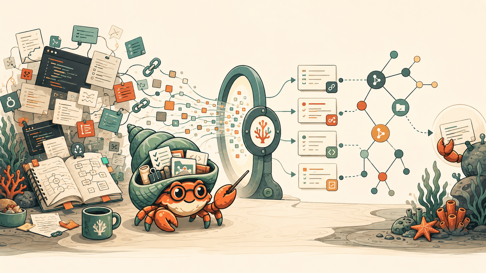
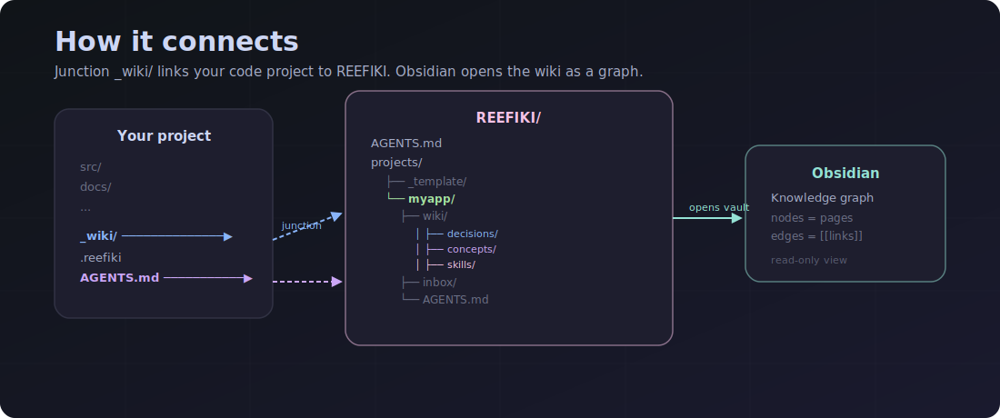
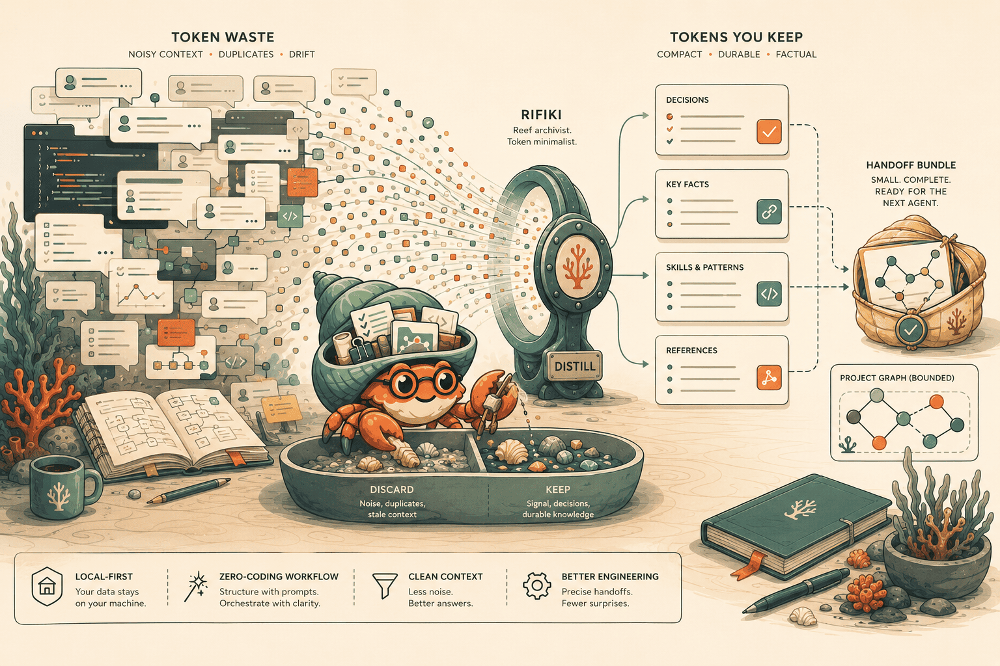

# REEFIKI



<p align="center">
  <a href="QUICKSTART.md#english"></a>
  <a href="LICENSE"></a>
  <a href="#safety"></a>
  <a href="#for-agents"></a>
  <a href="docs/PUBLIC_DEMO.md#english"></a>
  <a href="COMMANDS.md#english"></a>
</p>

AI agents are fast, but they are bad at remembering project context: decisions stay buried in chats, useful procedures disappear, and the next agent starts from zero again.

**REEFIKI** solves that problem as a local wiki memory for AI agents: it keeps only the knowledge that is likely to be useful again, not the whole session noise.

[Русский](README.md) · [中文](README.zh-CN.md) · [Quick Start](QUICKSTART.md#english) · [Commands](COMMANDS.md#english)

---

## The Problem

AI-agent work often breaks not because of code, but because of memory.

After a few threads, the same issues appear:

- an important decision is stuck in a chat and cannot be found;
- a new agent does not know why the project is shaped this way;
- a useful trick was discovered once but never became a reusable skill;
- links, notes, and conclusions get mixed with drafts and noise;
- agent memory becomes either too short or too dirty.

A normal note-taking system does not fully solve this either: it is easy to save everything, but hard to separate reusable knowledge from accidental context.

## What REEFIKI Is

REEFIKI is a local multi-project distillation wiki for AI agents.

In practice:

- every project has its own wiki;
- the agent saves decisions, skills, conclusions, and sources there;
- weak or temporary material is deferred instead of polluting the base;
- everything is stored as markdown files with git history;
- workflow rules live in `AGENTS.md`, so different agents can follow them.

REEFIKI is not another chatbot, cloud memory service, or archive of every message. It is a filter that turns working chaos into short, verifiable, portable project memory.

## Why It Exists

REEFIKI is useful when you work with AI agents regularly and want them to:

- continue with awareness of past decisions;
- avoid repeating mistakes that were already solved;
- recover project context quickly;
- save procedures as reusable skills;
- separate private memory from public material;
- hand work off between Codex, Claude Code, Cursor, Windsurf, and other agents.

The core idea: **an agent should not only finish a task, but also leave a reusable trace behind**.

## How It Works



REEFIKI follows a simple cycle:

1. **Capture**: a link, file, decision, or conclusion enters the project inbox.
2. **Filter**: the agent checks whether it can be applied again.
3. **Save**: useful material becomes a wiki page, skill, decision, or synthesis.
4. **Link**: pages get links, an index entry, and a log record.
5. **Recall later**: the next agent answers from the accumulated wiki, not from guesses.

REEFIKI uses a few durable memory types:

| Type | What it stores |
|---|---|
| `sources` | where an idea or material came from |
| `concepts` | reusable understanding |
| `decisions` | a decision and its reason |
| `skills` | a reproducible procedure |
| `synthesis` | conclusions from a session or project stage |

## Rifiki


Rifiki is a small reef crab archivist: a keeper of the reef wiki who does not drag every grain of sand into memory, but selects the useful shells. In the README, Rifiki is a metaphor: session noise on the left, distillation in the center, clean project memory on the right.

## Quick Start

If you already have a code project, open REEFIKI and tell the agent:

```text
Connect H:\Projects\MyApp to the wiki
```

The agent will create a separate wiki project and add a `_wiki/` link to the code project.

If you want to start a new wiki from scratch:

```text
Create a new project metrica about product analytics
```

Then work with plain phrases:

| You say | The agent does |
|---|---|
| "put this in the inbox" | saves material for later processing |
| "process the inbox" | turns useful material into wiki pages |
| "remember this as a decision" | saves a durable decision |
| "save this as a skill" | records a reusable procedure |
| "what did we decide about sync?" | answers only from the accumulated wiki |
| "capture the session conclusions" | saves a synthesis |

Full first-run guide: [QUICKSTART.md](QUICKSTART.md#english).

## What It Can Do Today

- Separate wiki projects under `projects/<name>/`.
- Connect an existing code project through `_wiki`.
- Capture -> process -> query -> harvest workflow.
- Agent-agnostic rules through `AGENTS.md`.
- Local markdown files instead of closed cloud storage.
- Wiki log and index.
- Health/lint checks to keep the base from becoming a dump.
- Handoff context for the next agent.
- Guarded publish flow for private/public boundaries.

Full capability map: [COMMANDS.md](COMMANDS.md#english).

## What REEFIKI Is Not

REEFIKI is intentionally not:

- a storage system for every chat message;
- a replacement for git, Obsidian, or an issue tracker;
- an automatic cloud sync service;
- a vector database "just in case";
- a system that writes anywhere without project boundaries.

If material cannot be applied again, it should not become durable wiki memory.

## Safety

REEFIKI is local-first by default:

- user wiki projects stay local;
- `raw/` is treated as an immutable archive;
- secrets, binaries, and oversized files are not saved automatically;
- public/private publication goes through a guarded flow;
- the agent should stage and commit only specific touched paths.

In short: REEFIKI makes memory useful without blurring project boundaries.

## For Agents

Agents do not need to remember internal commands. They read `AGENTS.md` and follow the project contract:

- from the REEFIKI root, they can create and connect projects;
- inside `projects/<name>/`, they can save and process knowledge;
- old `wiki/log.md` entries are never rewritten;
- `raw/` is not edited;
- all durable writes must be explainable and reproducible.

That makes REEFIKI portable across Codex, Claude Code, Cursor, Windsurf/Cascade, Cline, and other LLM agents.

## Token Economy



REEFIKI reduces token waste not by magically compressing everything, but by making the agent read less junk.

- Instead of the whole chat, the agent recalls short `decisions`, `skills`, `concepts`, and `synthesis` pages.
- Projects are isolated, so unrelated context does not leak into the current task.
- `wiki/index.md` and the log help find relevant pages without rereading the whole base.
- The handoff pack builds a bounded context bundle for the next agent.
- Weak material stays in the inbox or refusal path instead of becoming permanent memory.

Rule of thumb, not a guarantee: one short `decision` or `skill` page is often around 500-2,000 tokens and can replace 5,000-30,000 tokens of old chat context. A practical handoff pack usually stays around 2,000-8,000 tokens instead of tens of thousands of history tokens.

On repeat tasks, this often means roughly 50-90% fewer context-reading tokens; for returning to one decision or skill, the reduction can be 70-95%.

Details: [docs/TOKEN_ECONOMY.md#english](docs/TOKEN_ECONOMY.md#english).

## Next

- [QUICKSTART.md](QUICKSTART.md#english): first run without knowing the CLI.
- [COMMANDS.md](COMMANDS.md#english): all REEFIKI operations.
- [docs/TOKEN_ECONOMY.md](docs/TOKEN_ECONOMY.md#english): how REEFIKI saves tokens.
- [docs/INSTALL.md](docs/INSTALL.md#english): CLI install and smoke test.
- [docs/obsidian-setup.md](docs/obsidian-setup.md#english): safe Obsidian setup.
- [docs/WORKTREE_LIFECYCLE.md](docs/WORKTREE_LIFECYCLE.md#english): isolated worktree workflow.
- [docs/PUBLIC_DEMO.md](docs/PUBLIC_DEMO.md#english): public demo and boundaries.
- [docs/RECOVERY.md](docs/RECOVERY.md#english): recovery after failures.

Current roadmap: [ROADMAP.md](ROADMAP.md). Working backlog: [TASKS.md](TASKS.md).

## License

REEFIKI code is distributed under Apache License 2.0. See [LICENSE](LICENSE).

Wiki-project content belongs to the user who created or added it.

Inspirations: Karpathy's LLM Wiki gist, the REEF protocol, and Vannevar Bush's Memex.
