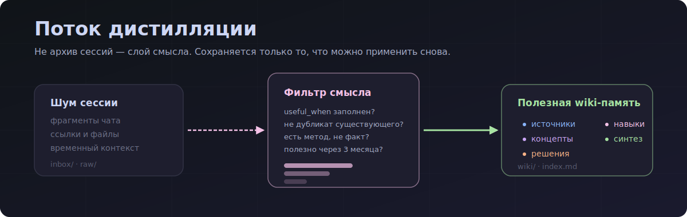
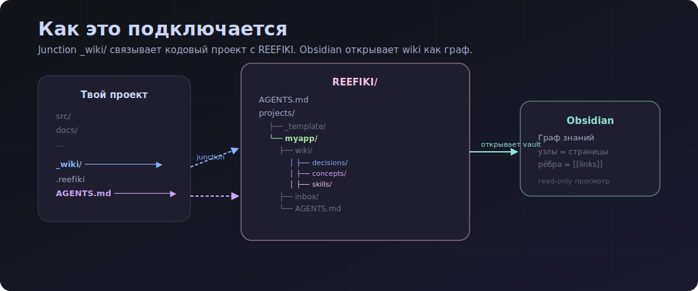
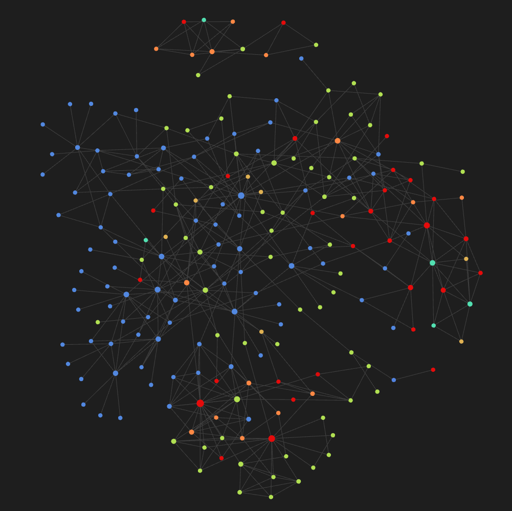
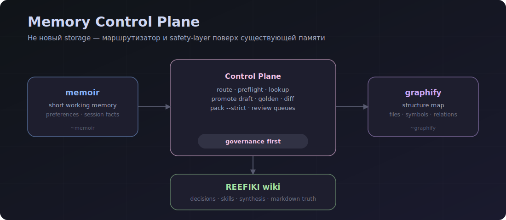
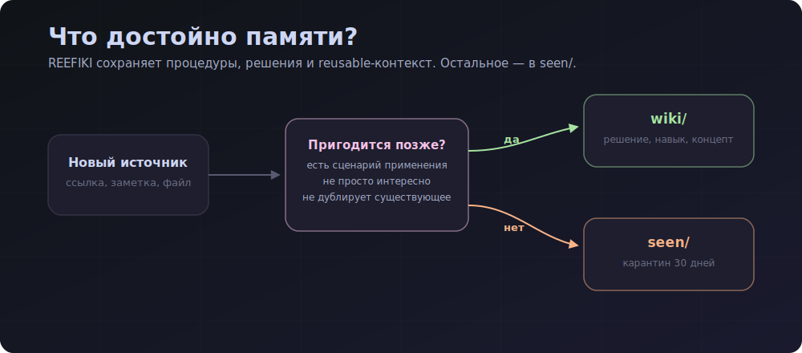
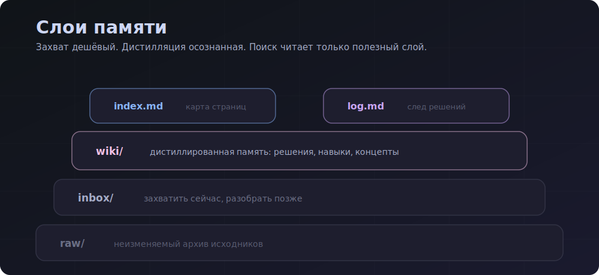

# REEFIKI 2.0



Мульти-проектная LLM-вики и memory control plane: персональная база знаний, которую ведёт AI-агент.
**Agent-agnostic:** работает из Claude Code, Codex, Cursor, Windsurf/Cascade и любого другого LLM-агента через единый `AGENTS.md`.

REEFIKI хранит не весь шум сессий, а только решения, навыки, выводы и источники, которые реально пригодятся в будущей работе.

REEFIKI 2.0 добавляет слой управления памятью поверх трёх контуров: `memoir` для короткой рабочей памяти, REEFIKI wiki для durable knowledge и `graphify` для структурной карты кода. Это не новый storage, а routing/safety/control plane поверх уже существующих слоёв.

Languages: [English](README.en.md) · [中文](README.zh-CN.md)

---

## Как это работает





_Реальный граф текущего REEFIKI vault в Obsidian: цветные узлы — типы wiki-страниц (`sources`, `decisions`, `skills`, `synthesis`, `concepts`, `entities`), линии — `[[wikilinks]]`; архивы, inbox и служебные markdown-файлы скрыты фильтром._

Агент не ждёт slash-команд. Он сам предлагает сохранить решение, зафиксировать навык или собрать выводы из сессии, когда видит подходящий момент.

---

## REEFIKI 2.0 — memory control plane



REEFIKI 2.0 связывает три слоя памяти, но не смешивает их в одну базу:

| Слой | Роль | Когда использовать |
|---|---|---|
| `memoir` | короткая рабочая память агента | предпочтения, мелкие правила, session facts |
| `REEFIKI wiki` | durable markdown truth | решения, навыки, процедуры, synthesis |
| `graphify` | структурная карта проекта | файлы, символы, связи, навигация по codebase |

Control plane поверх них делает:

- `memory route` — решает, куда должен попасть новый факт;
- `memory preflight` — проверяет project/private/public boundaries до чтения providers;
- `memory lookup` — поднимает контекст из доступных слоёв;
- `memory promote --write-draft` — готовит review draft вместо auto-write;
- `memory golden` — проверяет качество lookup/promote на стабильных вопросах;
- `memory diff` — показывает durable wiki diff;
- `memory pack --strict` — собирает handoff-пакет для нового агента и падает, если качество/безопасность не проходят.

Для пользователя это значит: если в новом треде написать «продолжай REEFIKI 2», агент сам должен поднять context pack и golden checks. Команды помнить не нужно.

Guardrail: REEFIKI 2 не должен заводить новый durable `daily notes` слой. Если нужен session/activity timeline, он должен быть derivable view из `wiki/log.md`, `harvest`, `memory pack` и других уже существующих артефактов, а не набор коммитящихся daily-файлов.

---

## Философия



REEFIKI — это не склад всех ответов агента. Это фильтр памяти: сохраняется только то, что можно применить снова.

| Слой | Что хранит |
|---|---|
| `sources` | откуда пришла идея |
| `concepts` | reusable-понимание |
| `decisions` | принятое решение |
| `skills` | воспроизводимая процедура |
| `synthesis` | выводы из сессии |



---

## Что сейчас умеет

- Подключает любой кодовый проект через `_wiki` junction/symlink.
- Хранит знания отдельно по проектам в `projects/<name>/`.
- Поддерживает `/save`, `/process`, `/query`, `/harvest`, `/status`, `/lint`, `/reindex`, `/resolve`, `/help`.
- Даёт `deep-research/` шаблон для source-heavy исследований, которые ещё рано превращать в wiki-страницу.
- Даёт read-only memory governance helpers в `scripts/reefiki.py`: `search`, `backlinks`, `promote-dry-run`, `review-queues` и глобальный `memory` entrypoint.
- `search` умеет frontmatter/link filters (`--type`, `--tag`, `--link-to`, `--linked-by`, `--orphan`) и heading-aware chunks через `--chunks`.
- `backlinks` строит generated link graph: incoming/outgoing links, orphans, broken links.
- `promote-dry-run --write-draft` может записать promotion draft в `plans/` без изменения durable pages.
- `promote-dry-run --apply-draft <path> --yes` может по явному подтверждению создать реальную durable wiki-страницу из draft.
- `review-queues --type <queue>` фильтрует конкретную очередь; `--write-report` может записать triage artifact без изменения durable pages.
- `memory status --project <name>` показывает provider registry, capabilities, review queues и promotion inbox counts для выбранного REEFIKI project; `--all-projects` даёт сводку по всем projects, `--only-open` фильтрует проекты без открытых очередей, `--summary` убирает provider details, `--fail-on-open` возвращает ошибку при open queues, `--format jsonl` отдаёт project-per-line output.
- `memory preflight` проверяет project/private/public boundaries до lookup/promote/export/pack.
- `memory route` выбирает правильный слой памяти для нового факта.
- `memory explain` объясняет route decision, policy check, selected/excluded sources и next action.
- `memory lookup` делает единый lookup по `memoir`, `REEFIKI` и `graphify` после policy preflight.
- `memory promote --write-draft` делает глобальный promotion gate и пишет review draft в выбранный REEFIKI project после policy preflight.
- `memory promotion-inbox` показывает активные promotion drafts, раскрывает draft, применяет `--apply <path> --yes`, отклоняет `--reject <path> --reason ... --yes`; `--prune-closed --yes` переносит закрытые drafts в `plans/closed/`, `--all` показывает и архив.
- `memory golden` прогоняет `golden-queries.yml` проекта как baseline для lookup/promote качества и возвращает `misses`/`eval`.
- `memory diff` показывает git-based изменения durable wiki между ref/date baseline и worktree/ref.
- `memory pack --strict` собирает right-sized handoff bundle для задачи: contents, why_included, quality/strict verdict, golden/diff summaries, open queues и exclusions.
- При упоминании REEFIKI 2 агент должен сам запускать `memory pack --strict` и `memory golden`; пользователь не обязан помнить команды.
- Валидирует wiki-страницы: обязательные поля, `useful_when`, `sources`, `use_count`, `last_used`, секции индекса и запрет старого `importance`.
- Учитывает типы страниц: `sources`, `entities`, `concepts`, `synthesis`, `decisions`, `skills`.
- Публикует безопасный public snapshot без личных wiki-проектов.

---

## Вариант A — подключить существующий проект

Если у тебя уже есть кодовый проект (`H:\Projects\MyApp`) и ты хочешь вести по нему вики:

**1.** Открой папку `REEFIKI/` в IDE.

**2.** Скажи агенту:

```text
Подключи проект H:\Projects\MyApp к вики
```

**Агент сам:**

- создаст вики-проект в `REEFIKI/projects/myapp/`;
- создаст ссылку `MyApp\_wiki` → `REEFIKI\projects\myapp`;
- положит маркер `.reefiki` в корень кодового проекта;
- добавит в `AGENTS.md` кодового проекта правила чтения и сохранения знаний;
- зафиксирует, что `_wiki/` — это bridge, а durable knowledge пушится только в repo `REEFIKI`, не в git-историю кодового проекта.

**3.** Открой `MyApp/` в IDE как основной проект и работай как обычно.

| Скажи агенту | Что сохранится |
|---|---|
| «запомни это» | `wiki/decisions/` или `concepts/` |
| «сохрани как навык» | `wiki/skills/` |
| «зафиксируй выводы сессии» | `wiki/synthesis/` |
| «сохрани ссылку» | `inbox/` (разбор позже) |
| «что мы решали про sync?» | ответ только из wiki |

---

## Вариант Б — начать с нуля

**1.** Открой `REEFIKI/` в IDE.

**2.** Скажи:

```text
создай новый проект <имя> про <тему>
```

**3.** Агент выполнит `/new`: скопирует `projects/_template/`, заполнит `_domain.md` и подготовит структуру проекта.

**4.** Открой `projects/<имя>/` и начинай работать.

---

## Основные команды

| Хочу | Команда | Можно сказать |
|---|---|---|
| Сохранить URL/файл на потом | `/save` | «положи это в копилку» |
| Разобрать накопленное | `/process` | «разбери копилку» |
| Спросить у вики | `/query` | «что мы решали про X?» |
| Зафиксировать выводы | `/harvest` | «запомни выводы сессии» |
| Состояние проекта | `/status` | «что в копилке?» |
| Проверить здоровье вики | `/lint` | «проверь вики» |
| Пересобрать индекс | `/reindex` | «пересобери индекс» |
| Dry-run memoir → REEFIKI | `reefiki.py promote-dry-run` | «стоит ли это поднимать из memoir?» |
| Governance scan durable pages | `reefiki.py review-queues` | «что у нас stale/orphan/duplicate?» |
| Проверить memory status / open queues | `reefiki.py memory status` | «какие memory providers доступны и есть ли открытые очереди?» |
| Проверить memory safety | `reefiki.py memory preflight` | «безопасно ли это паковать/публиковать?» |
| Выбрать memory layer | `reefiki.py memory route` | «это класть в memoir, REEFIKI или graph?» |
| Единый lookup по слоям | `reefiki.py memory lookup` | «что у нас вообще есть по X?» |
| Глобальный promotion dry-run | `reefiki.py memory promote` | «подними это в durable knowledge проекта Y» |
| Golden query baseline | `reefiki.py memory golden` | «проверь качество memory lookup/promote» |
| Durable memory diff | `reefiki.py memory diff` | «что изменилось в durable wiki?» |
| Handoff memory pack | `reefiki.py memory pack` | «собери контекст для следующего агента» |
| Подключить кодовый проект | `/connect` | «подключи проект к вики» |
| Синхронизировать шаблон | `/sync-template` | «обнови проекты из шаблона» |

Полный справочник: [`COMMANDS.md`](COMMANDS.md).

История заметных изменений: [`CHANGELOG.md`](CHANGELOG.md).

---

## Проверка целостности

Перед commit/push полезно запускать:

```powershell
python scripts/validate_frontmatter.py (rg --files projects | ? { $_ -match '[/\\]wiki[/\\].+\.md$' })
```

Для машинной проверки:

```powershell
python scripts/validate_frontmatter.py --format json (rg --files projects | ? { $_ -match '[/\\]wiki[/\\].+\.md$' })
```

JSON возвращает `outcome`, `checked`, `errors[]`; каждая ошибка содержит `path`, `code`, `message`, `line`, `column`, `expected`, `actual`.

Валидатор проверяет:

- обязательные поля wiki-страниц;
- `sources` для `source` и `synthesis`;
- `verified` только для `skill`;
- отсутствие устаревшего `importance`;
- совпадение `Total pages` и файлов в `wiki/`;
- обязательные секции индекса, включая `## Skills`.

---

## Визуализация в Obsidian

REEFIKI — это папка с markdown-файлами. Открой её в [Obsidian](https://obsidian.md) как Vault: узлы графа — wiki-страницы, рёбра — `[[wikilinks]]`. Полнотекстовый поиск, теги и фильтры работают из коробки.

Базовая настройка:

1. Скачай [Obsidian](https://obsidian.md).
2. Open Vault → выбери папку `REEFIKI/`.
3. Граф → Фильтры → убери архивы и служебные файлы.
4. Граф → Группировка → раскрась типы страниц по папкам `wiki/sources`, `wiki/decisions`, `wiki/skills`, `wiki/synthesis`, `wiki/concepts`, `wiki/entities`.
5. Граф → Отображение → выключи одиночные страницы, если нужен чистый рабочий вид без служебного шума.

Рекомендуемый фильтр:

```text
-path:"projects/_template/" -path:"/raw/" -path:"/inbox/" -path:"/seen/" -path:"/deep-research/" -path:"/.claude/" -path:"/.agents/" -path:"/.codex/" -path:"/.windsurf/" -path:"/.pytest_cache/" -path:"/plans/" -file:CLAUDE -file:_domain -file:README
```

---

## Установка на новый ПК

```powershell
git clone https://github.com/<user>/reefiki
```

REEFIKI использует стаб-файлы: короткие входные точки для IDE/CLI, которые ссылаются на главный `AGENTS.md`.

| IDE / CLI | Что читает | Файл |
|---|---|---|
| Claude Code | `CLAUDE.md` | есть |
| Cursor | `.cursorrules` | есть |
| Windsurf / Cascade | `.windsurf/rules/main.md` | есть |
| Codex CLI | `.codex/instructions.md` | есть |
| Cline / Roo Cline | `.clinerules` | есть |
| Serena | `.serena/project.yml` | есть (initial_prompt) |
| ChatGPT / Web Claude | `AGENTS.md` | загрузить как project knowledge |
| Другой агент | `AGENTS.md` | основной контракт |

Шаблон для нового агента:

```md
Следуй инструкции: AGENTS.md (в корне этого репо).
```

---

## Public и private repos

Один рабочий каталог может пушить в два remote:

- `origin` — private repo с личными wiki-проектами;
- `public` — public repo только с шаблоном и инфраструктурой.

Для public-публикации:

```powershell
.\scripts\push-public.ps1
```

Скрипт создаёт filtered snapshot и исключает личные проекты вроде `projects/Hermes/`, `projects/metrica/` и `projects/reefiki/`.
Если в `projects/` появляется новый реальный проект и его забыли добавить в `scripts/public-snapshot.private-projects.txt`, public push теперь должен падать до ручного решения.

---

## Структура файлов

```text
REEFIKI/
├── AGENTS.md
├── CLAUDE.md
├── .cursorrules
├── .windsurf/rules/main.md
├── .codex/instructions.md
├── COMMANDS.md
├── ROADMAP.md
├── scripts/
│   ├── validate_frontmatter.py
│   └── push-public.ps1
├── .claude/commands/
│   ├── new.md
│   ├── connect.md
│   └── sync-template.md
└── projects/
    ├── _template/
    └── <project>/
        ├── AGENTS.md
        ├── _domain.md
        ├── .claude/commands/
        ├── inbox/
        ├── deep-research/
        ├── seen/
        ├── raw/
        └── wiki/
            ├── _schema.md
            ├── index.md
            ├── log.md
            ├── sources/
            ├── entities/
            ├── concepts/
            ├── synthesis/
            ├── decisions/
            └── skills/
```

---

## Принципы

- **Дистилляция, не архивация.** Сохраняется практический вывод, а не весь контент.
- **`useful_when` обязателен.** Нет сценария применения — нет wiki-страницы.
- **Процедура > факт.** Проверенный способ важнее одноразового ответа.
- **Изоляция проектов.** Каждая wiki живёт в своём `projects/<name>/`.
- **Логируется всё.** `wiki/log.md` append-only.

---

## Источники идеи

- Andrej Karpathy, [LLM Wiki gist](https://gist.github.com/karpathy/442a6bf555914893e9891c11519de94f)
- Vannevar Bush, [As We May Think / Memex](https://www.theatlantic.com/magazine/archive/1945/07/as-we-may-think/303881/)
- [Obsidian](https://obsidian.md)-style markdown knowledge bases
- [`memoir`](https://memoir.sh/) / Memoir-style short working memory: отдельный слой для предпочтений и session facts, не durable wiki.
- [`graphify`](https://github.com/safishamsi/graphify): структурная карта codebase, которую REEFIKI использует как navigation layer, а не как замену wiki.
