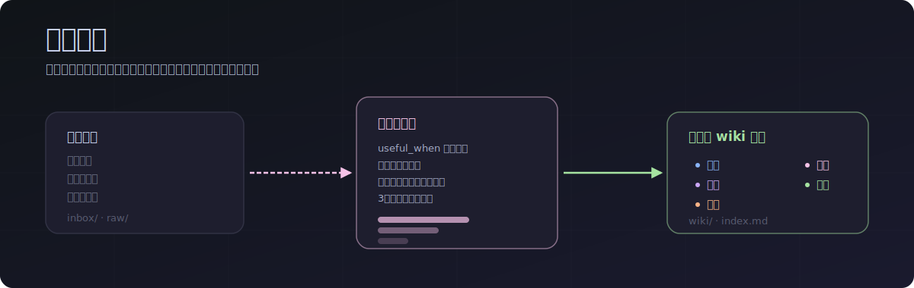
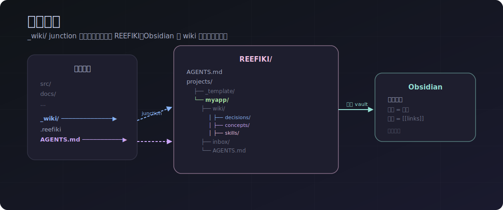
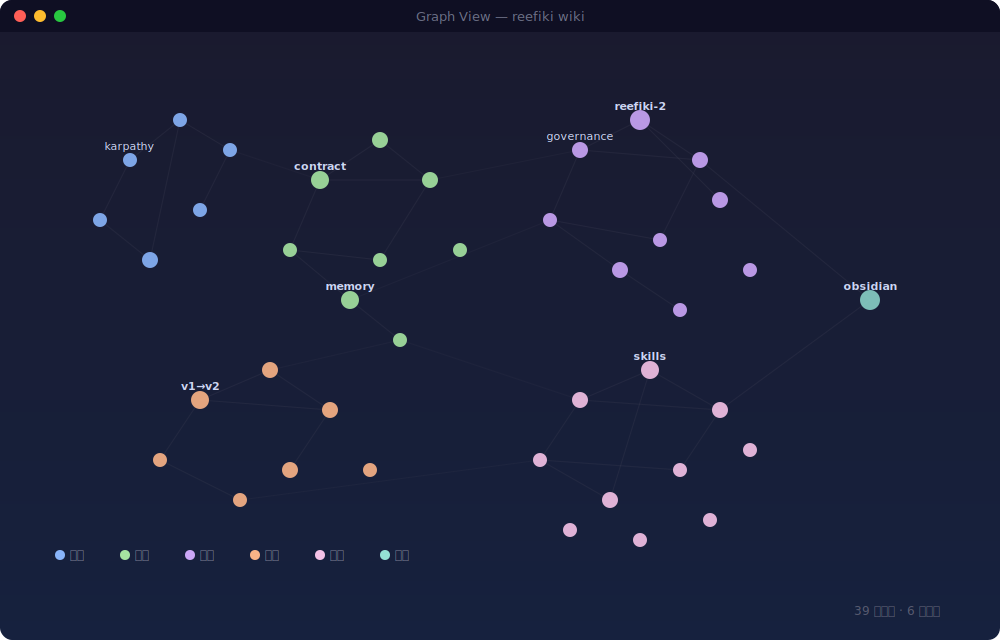
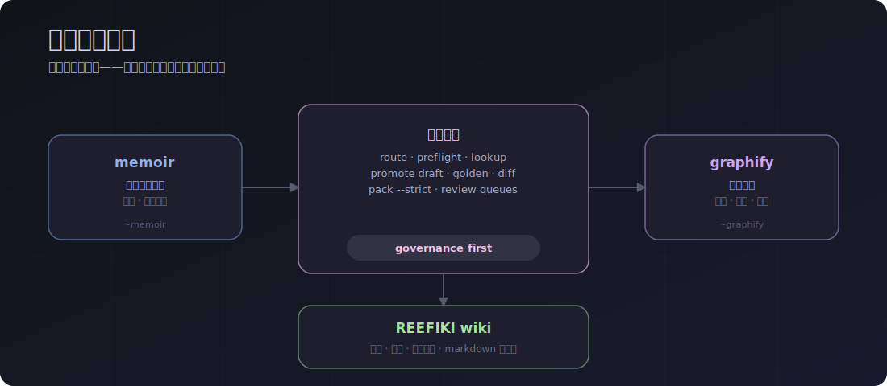
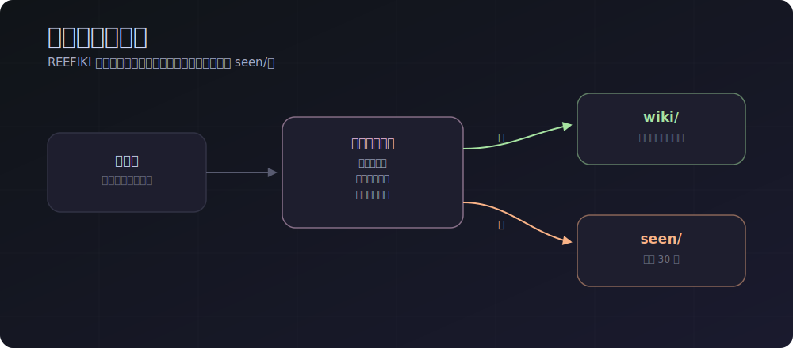
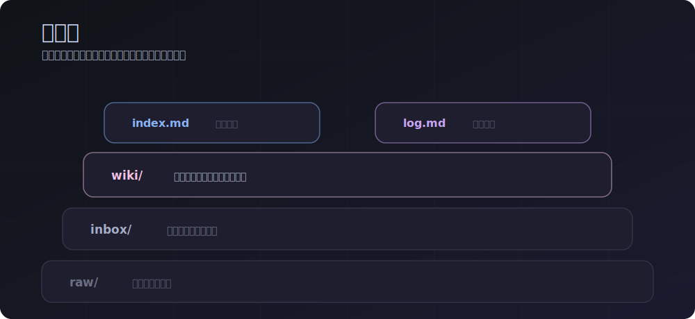

# REEFIKI 2.0



多项目 LLM wiki 和记忆控制平面：由 AI Agent 维护的个人知识库。
**Agent-agnostic：** 通过统一的 `AGENTS.md` 支持 Claude Code、Codex、Cursor、Windsurf/Cascade 和其他 Agent。

REEFIKI 不保存整段会话噪音，只保存未来真正有用的决策、可复用技能、综合结论和来源材料。

REEFIKI 2.0 在三层记忆之上增加治理层：`memoir` 保存短期工作记忆，REEFIKI wiki 保存持久知识，`graphify` 保存代码结构地图。它不是新的存储层，而是在已有记忆之上做路由、安全检查和 handoff 打包。

语言：[Русский](README.md) · [English](README.en.md)

---

## 工作方式





Agent 不需要等待 slash 命令。它可以在合适的时候主动建议保存决策、可复用流程或会话综合结论。

---

## REEFIKI 2.0 — 记忆控制平面



REEFIKI 2.0 连接三层记忆，但不会把它们混成一个数据库：

| 层 | 角色 | 适合保存 |
|---|---|---|
| `memoir` | 短期工作记忆 | 偏好、小规则、会话事实 |
| `REEFIKI wiki` | 持久 Markdown 真相源 | 决策、技能、流程、综合结论 |
| `graphify` | 项目结构地图 | 文件、符号、关系、代码导航 |

控制平面提供：

- `memory route` — 判断新事实应该进入哪一层；
- `memory preflight` — 在读取 provider 前检查项目边界和公开/私有边界；
- `memory lookup` — 从可用层中找上下文；
- `memory promote --write-draft` — 写 review draft，而不是自动写入持久 wiki；
- `memory golden` — 用稳定用例检查 lookup/promote 质量；
- `memory diff` — 显示持久 wiki 的变化；
- `memory pack --strict` — 为新线程/新 agent 生成 handoff pack，质量或安全不通过时失败。

对用户来说，只要在新线程写“继续 REEFIKI 2”，Agent 就应该自己运行 context pack 和 golden checks。

---

## 哲学



REEFIKI 不是保存所有 Agent 回答的仓库。它是记忆筛选器：只有未来可以复用的知识才应该进入 wiki。

| 层 | 保存内容 |
|---|---|
| `sources` | 想法来自哪里 |
| `concepts` | 可复用理解 |
| `decisions` | 已接受的决策 |
| `skills` | 可复现流程 |
| `synthesis` | 会话结论 |



---

## 当前能力

- 通过 `_wiki` junction/symlink 连接任意代码项目。
- 按项目隔离知识，存放在 `projects/<name>/`。
- 支持 `/save`、`/process`、`/query`、`/harvest`、`/status`、`/lint`、`/reindex`、`/resolve`、`/help`。
- 提供 REEFIKI 2.0 memory 命令：`status`、`preflight`、`route`、`lookup`、`promote`、`golden`、`diff`、`pack --strict`。
- 在 REEFIKI 2 任务中，Agent 应该自动运行 `memory pack --strict` 和 `memory golden`。
- 校验 wiki 页面：必填字段、`useful_when`、`sources`、`use_count`、`last_used`、索引章节，以及废弃字段 `importance`。
- 支持页面类型：`sources`、`entities`、`concepts`、`synthesis`、`decisions`、`skills`。
- 可以发布安全的 public snapshot，不包含个人 wiki 项目。

---

## 方案 A：连接已有项目

如果你已经有代码项目（例如 `H:\Projects\MyApp`），并想为它维护 wiki：

**1.** 在 IDE 中打开 `REEFIKI/`。

**2.** 告诉 Agent：

```text
把 H:\Projects\MyApp 连接到 wiki
```

**Agent 会：**

- 如果需要，创建 `REEFIKI/projects/myapp/`；
- 创建 `MyApp\_wiki` → `REEFIKI\projects\myapp`；
- 在代码项目根目录添加 `.reefiki`；
- 在代码项目的 `AGENTS.md` 中加入 REEFIKI 规则。

**3.** 打开 `MyApp/` 作为主项目，然后正常工作。

| 告诉 Agent | 保存到哪里 |
|---|---|
| “记住这个” | `wiki/decisions/` 或 `concepts/` |
| “保存成技能” | `wiki/skills/` |
| “记录本次会话结论” | `wiki/synthesis/` |
| “保存这个链接” | `inbox/`（稍后处理）|
| “我们之前对 sync 做过什么决定？” | 只根据 wiki 回答 |

---

## 方案 B：从零开始

**1.** 在 IDE 中打开 `REEFIKI/`。

**2.** 说：

```text
创建一个关于 <主题> 的新项目 <名称>
```

**3.** Agent 会执行 `/new`：复制 `projects/_template/`，填写 `_domain.md`，并准备项目结构。

**4.** 打开 `projects/<name>/`，开始工作。

---

## 主要命令

| 目标 | 命令 | 自然语言 |
|---|---|---|
| 保存 URL/文件稍后处理 | `/save` | “放进 inbox” |
| 处理积累内容 | `/process` | “处理 inbox” |
| 询问 wiki | `/query` | “我们对 X 做过什么决定？” |
| 保存会话结论 | `/harvest` | “记录本次会话结论” |
| 查看项目状态 | `/status` | “inbox 里有什么？” |
| 检查 wiki 健康状态 | `/lint` | “检查 wiki” |
| 重建索引 | `/reindex` | “重建索引” |
| 连接代码项目 | `/connect` | “把项目连接到 wiki” |
| 同步模板 | `/sync-template` | “用模板更新项目” |

完整命令说明：[`COMMANDS.md`](COMMANDS.md)。

重要项目变更：[`CHANGELOG.md`](CHANGELOG.md)。

---

## 完整性检查

commit 或 push 前建议运行：

```powershell
python scripts/validate_frontmatter.py (rg --files projects | ? { $_ -match '[/\\]wiki[/\\].+\.md$' })
```

校验器会检查：

- wiki 页面必填字段；
- `source` 和 `synthesis` 必须有 `sources`；
- 只有 `skill` 可以有 `verified`；
- 禁止废弃字段 `importance`；
- `Total pages` 必须与 `wiki/` 中实际文件数量一致；
- 索引必须包含必要章节，包括 `## Skills`。

---

## Obsidian

REEFIKI 可以作为 [Obsidian](https://obsidian.md) Vault 打开。图谱节点是 wiki 页面，连接是 `[[wikilinks]]`。全文搜索、标签和过滤器开箱即用。

设置：

1. 安装 [Obsidian](https://obsidian.md)。
2. Open Vault → 选择 `REEFIKI/`。
3. Graph → Filters → 输入 `-path:raw`，隐藏来源归档文件。

---

## 在新电脑上安装

```powershell
git clone https://github.com/<user>/reefiki
```

REEFIKI 使用 stub 文件：这些是 IDE/CLI 的短入口，指向主规则 `AGENTS.md`。

| IDE / CLI | 读取文件 | 文件 |
|---|---|---|
| Claude Code | `CLAUDE.md` | 已包含 |
| Cursor | `.cursorrules` | 已包含 |
| Windsurf / Cascade | `.windsurf/rules/main.md` | 已包含 |
| Codex CLI | `.codex/instructions.md` | 已包含 |
| Cline / Roo Cline | `.clinerules` | 已包含 |
| Serena | `.serena/project.yml` | 已包含 (initial_prompt) |
| ChatGPT / Web Claude | `AGENTS.md` | 作为 project knowledge 加载 |
| 其他 Agent | `AGENTS.md` | 主契约 |

新 Agent 的 stub 模板：

```md
Follow the instructions in AGENTS.md at the repository root.
```

---

## Public 和 Private 仓库

一个工作目录可以推送到两个 remote：

- `origin` — private 仓库，包含个人 wiki 项目；
- `public` — public 仓库，只包含模板和基础设施。

发布 public 版本：

```powershell
.\scripts\push-public.ps1
```

该脚本会创建过滤后的 snapshot，并排除 `projects/Hermes/`、`projects/metrica/`、`projects/reefiki/` 等个人项目。
如果 `projects/` 下出现新的真实项目，但没有加入 `scripts/public-snapshot.private-projects.txt`，public push 现在应该直接失败，直到你显式处理这个决定。

---

## 目录结构

```text
REEFIKI/
├── AGENTS.md
├── CLAUDE.md
├── .cursorrules
├── .windsurf/rules/main.md
├── .codex/instructions.md
├── COMMANDS.md
├── ROADMAP.md
├── scripts/
│   ├── validate_frontmatter.py
│   └── push-public.ps1
├── .claude/commands/
│   ├── new.md
│   ├── connect.md
│   └── sync-template.md
└── projects/
    ├── _template/
    └── <project>/
        ├── AGENTS.md
        ├── _domain.md
        ├── .claude/commands/
        ├── inbox/
        ├── seen/
        ├── raw/
        └── wiki/
            ├── _schema.md
            ├── index.md
            ├── log.md
            ├── sources/
            ├── entities/
            ├── concepts/
            ├── synthesis/
            ├── decisions/
            └── skills/
```

---

## 原则

- **蒸馏，而不是归档。** 保存实际可用的结论，而不是所有内容。
- **`useful_when` 必填。** 没有使用场景，就不创建 wiki 页面。
- **过程优先于事实。** 经过验证的方法比一次性答案更有价值。
- **项目隔离。** 每个 wiki 都在自己的 `projects/<name>/` 中。
- **所有操作都要记录。** `wiki/log.md` 只追加，不改旧记录。

---

## 灵感来源

- Andrej Karpathy, [LLM Wiki gist](https://gist.github.com/karpathy/442a6bf555914893e9891c11519de94f)
- Vannevar Bush, [As We May Think / Memex](https://www.theatlantic.com/magazine/archive/1945/07/as-we-may-think/303881/)
- [Obsidian](https://obsidian.md) 风格的 markdown 知识库
- [`memoir`](https://memoir.sh/) / Memoir 风格的短期工作记忆，用于偏好和会话事实。
- [`graphify`](https://github.com/safishamsi/graphify) 作为代码结构地图和导航层。
